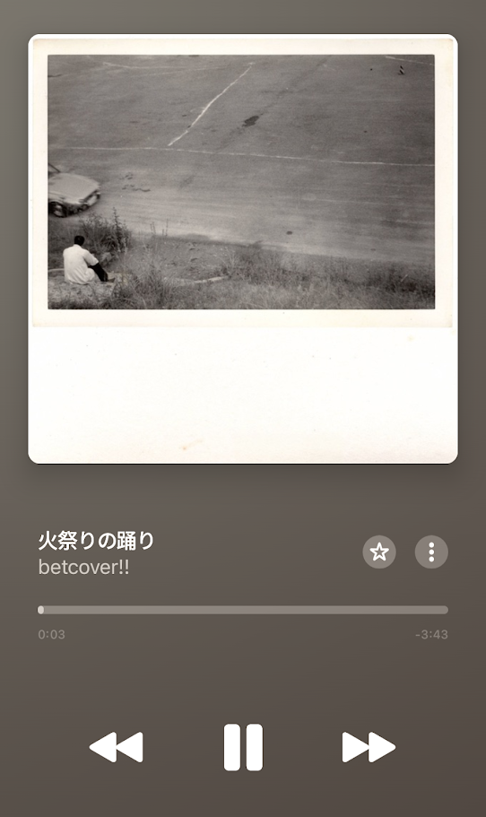
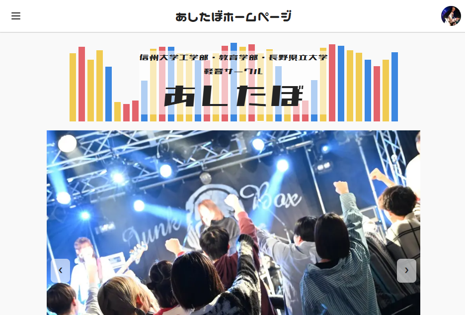
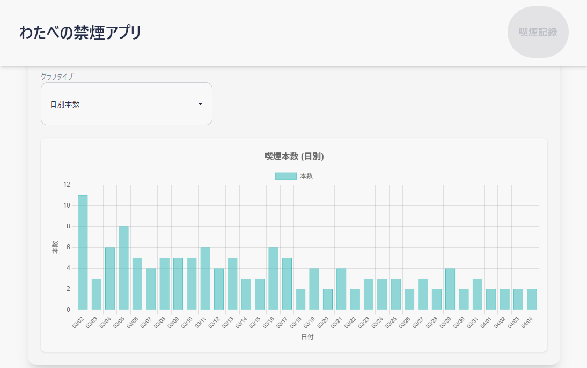
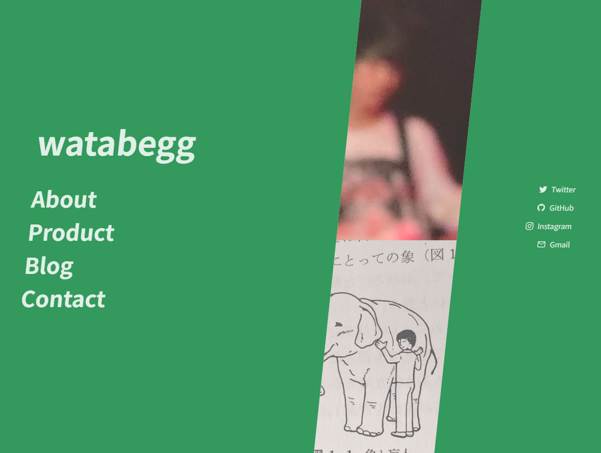

<!-- _class: lead -->
# @watabegg
## 自己紹介スライド

---

# About Me - 私について

*   **氏名**: 渡辺 大樹 (わたなべ だいき)
*   **居住地**: 日本 長野県
*   **所属**: 信州大学 工学部 電子情報システム工学科 (在学中)
    *   2027年03月卒業見込み

---

# Hobbies - 趣味

*   **音楽**: 邦楽、洋楽のロックバンド、ヒップホップ
    *   特にbetcover!!, kanekoayano, black midi, PAS TASTAとか
    *   [Apple Musicのプレイリスト](https://music.apple.com/library/playlist/p.ZOAXdxRh48VV3LD)
    *   軽音サークルでベースを担当
* **映画**: あんまり詳しくないけど
    *   最近(？)は「ホールドオーバーズ」,「RRR」,「BLUE GIANT」が面白かった
  

---

# Career - 経歴

*   **2018年04月 - 2021年03月**
    *   岐阜県立恵那高等学校 普通科 (卒業)
*   **2021年04月 - 現在**
    *   信州大学 工学部 電子情報システム工学科 (在学中)
*   **2024年03月 - 2024年11月**
    *   株式会社ウェブウェア (アルバイト)
*   **2024年11月 - 現在**
    *   ASUNA Frontier株式会社 (業務委託契約)
* 　**2027年03月**
    *   信州大学 工学部 電子情報システム工学科 (卒業予定)

---

# Skills - プログラミングスキル

*   **言語**:
    *   TypeScript, JavaScript, Python, PHP
*   **フレームワーク & ライブラリ**:
    *   Next.js, React, Astro, Tailwind CSS, GSAP, WordPress
*   **ツール**:
    *   Git, GitHub, Docker, Figma
*   **OS**:
    *   Linux (Ubuntu), Windows

---

# 軽音サークルHP & Webアプリ

*   **概要**: 所属する軽音サークルの公式HP兼部員向けWebアプリ
*   **目的**: 古いシステム(PHP + CSV)を刷新し、利便性向上と技術研鑽
*   **開発期間**: 2024年05月 - 現在
*   **使用技術**:
    *   Next.js, TypeScript, Prisma, PostgreSQL
    *   Auth.js (LINE OAuth), Vercel
*   **工夫点**:
    *   モダン技術への刷新、認証機能による便利機能の追加
    *   部室予約UI、限定公開ライブ映像検索機能
    *   チーム開発 (デザイン協力)
*   **成果物**: [あしたぼホームページ](https://www.ashitabo.net)

---

# 個人的禁煙用アプリ

*   **概要**: 自身の禁煙目的で開発した喫煙記録アプリ (現在は新規入力不可)
*   **使用技術**:
    *   Next.js, TypeScript, PostgreSQL, Vercel
    *   Chart.js (グラフ表示)
*   **工夫点**:
    *   シンプルなUI/UX
    *   喫煙データ可視化によるモチベーション維持
    *   LINE Messaging APIを利用した通知機能
*   **余談**: 放置していたら面接を受けた際にエンジニアの方にCurlでPOSTされた
*   **リンク**: [アプリ](https://no-smoke-nine.vercel.app/), [GitHub](https://github.com/watabegg/no-smoke)

---

# watabeggの個人サイト

*   **概要**: ポートフォリオ兼技術ブログ
*   **使用技術**:
    *   Astro, Tailwind CSS, daisyUI, GSAP
    *   View Transitions API (Astro経由), TypeScript
*   **目的**:
    *   制作物紹介、技術知見共有
    *   最新技術の試用とスキルアップ、就職活動でのアピール
*   **リンク**: [GitHub](https://www.github.com/watabegg/watabegg.github.io) [サイト](https://watabegg.github.io)

---

# Strengths - 強み

*   **課題発見・解決力**:
    *   自ら課題を発見し、技術と論理で解決に導く
*   **自主的な学習と実践**:
    *   独学と実践でNext.js + TypeScriptを中心としたフルスタック開発を習得
*   **実務・個人開発経験**:
    *   サークルWebアプリ開発 (企画・設計・実装・改善)
    *   ウェブウェア社でのビジネスマッチングサイト開発 (API連携、認証制御)
*   **論理的思考**:
    *   複雑な問題も構造化して理解し、段階的に解決策を見出す

---

# Future Goals - 今後の目標

*   **技術の深化**:
    *   Next.js + TypeScriptを中心に、フルスタック開発のスキルをさらに磨く
    *   新しい技術やフレームワークの習得
*   **チーム開発経験の拡充**:
    *   チームでの開発経験を積み、協調性とコミュニケーション能力を向上
    *   オープンソースプロジェクトへの貢献
*   **キャリアの発展**:
    *   フルスタックエンジニアとしてのキャリアを築き、将来的にはリーダーシップを発揮

---

<!-- _class: lead invert -->
# ご清聴ありがとうございました

**@watabegg**
